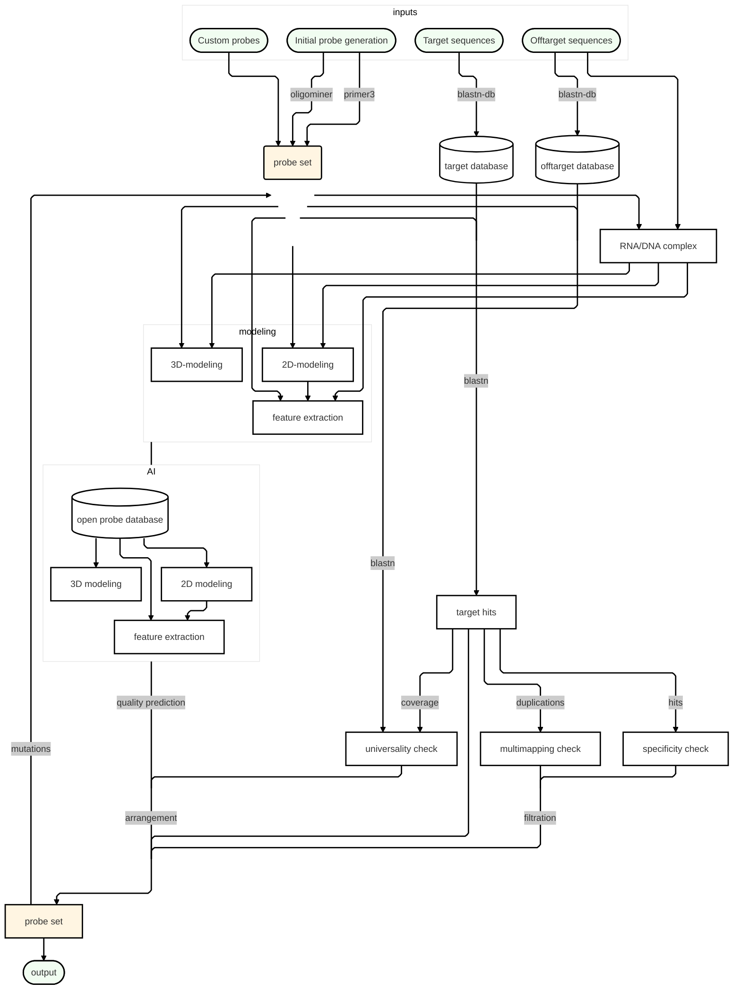
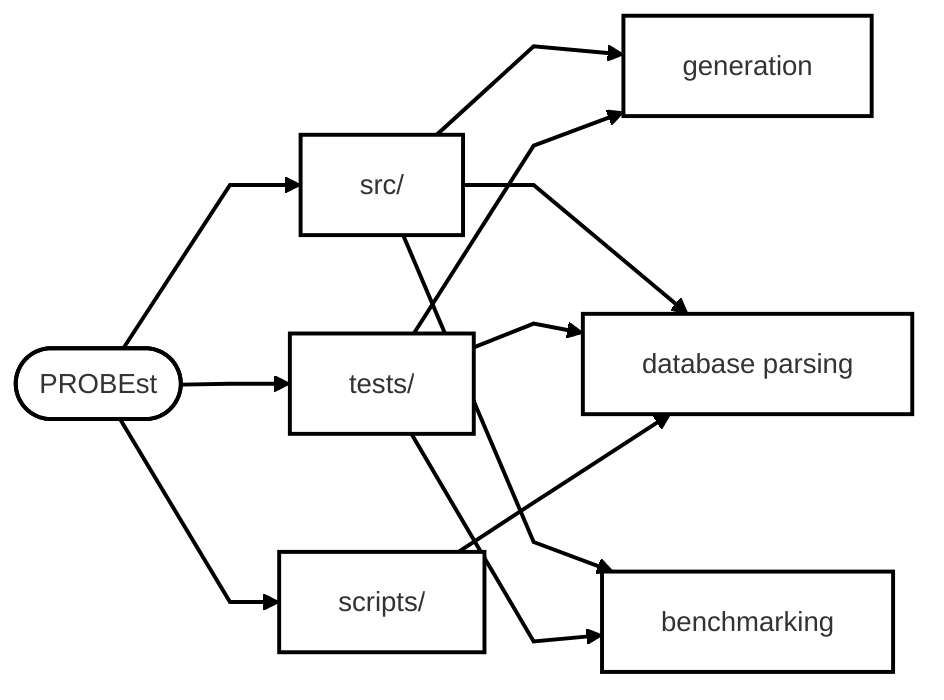

# PROBEst v.0.1.3. <a href=""></a> 
### St. Petersburg tool for genereting nucleotide probes with specified properties

<font color="red">**Warning**:</font> tool is under active development

**PROBEst** is a tool designed for generating nucleotide probes with specified properties, leveraging advanced algorithms and AI-driven techniques to ensure high-quality results. The tool is particularly useful for researchers and bioinformaticians who require probes with tailored universality and specificity for applications such as PCR, hybridization, and sequencing. By integrating a wrapped evolutionary algorithm, PROBEst optimizes probe generation through iterative refinement, ensuring that the final probes meet stringent biological and computational criteria.

At the core of PROBEst is an AI-enhanced workflow that combines Primer3 for initial oligonucleotide generation, BLASTn for specificity and universality checks, and a mutation module for probe optimization. The tool allows users to input target sequences, select reference files for universality and specificity validation, and customize layouts for probe design. The evolutionary algorithm iteratively refines the probes by introducing mutations and evaluating their performance, ensuring that the final output is both specific to the target and universally applicable across related sequences.


# Download and installation

## Installation

```bash
git clone https://github.com/CTLab-ITMO/PROBEst.git
cd PROBEst
pip install -e .
```


## Usage

## Preparation

`pipeline.py` relies on pre-prepared BLASTn databases. To create the required `true_base`, `false_base`, and `contig_table`, you can use the following script:

```bash
bash scripts/generator/prep_db.sh \
  -n {DATABASE_NAME} \
  -c {CONTIG_NAME} \
  -t {TMP_DIR} \
  [FASTA]
```

### Arguments:
- `-n DATABASE_NAME`:  Name of the output BLAST database (required).  
- `-c CONTIG_TABLE`:  Output file to store contig names and their corresponding sequence headers (required).  
- `-t TMP_DIR`:  Temporary directory for intermediate files (optional, defaults to `./.tmp`).  
- `FASTA`:  List of input FASTA files (gzipped or uncompressed). 

## Generation

PROBEst can be run using the following command:

```bash
python pipeline.py [-h] \
  -i {INPUT} \
  -tb {TRUE_BASE} \
  -fb [FALSE_BASE [FALSE_BASE ...]] \
  -c {CONTIG_TABLE} \
  -o {OUTPUT}
```

### Key Arguments:
- `-i INPUT`: Input FASTA file for probe generation.
- `-tb TRUE_BASE`: Input BLASTn database path for primer adjusting.
- `-fb FALSE_BASE`: Input BLASTn database path for non-specific testing.
- `-c CONTIG_TABLE`: .tsv table with BLAST database information.
- `-o OUTPUT`: Output path for results.
- `-t THREADS`: Number of threads to use.
- `-a ALGORITHM`: Algorithm for probe generation (`FISH` or `primer`).

For a full list of arguments, run:

```bash
python pipeline.py --help
```

For parameter selection, grid search is implemented. You can specify parameters in json (see for example `data/test/general/param_grid_light.json`) and run 

```bash
python test_parameters.py \
  -p {JSON}
```


# Algorithm

## Algorithm Steps

0. **Prepare BLASTn databases**

1. **Select File for Probe Generation** (`INPUT`)

2. **Select Files for Universality Check** (`TRUE_BASE`)

3. **Select Files for Specificity Check** (`FALSE_BASE`)
   
4. **Select Layouts and Run Wrapped Evolutionary Algorithm** (`pipeline.py`)
   - Execute the following steps within the evolutionary algorithm:
   
   a. **Primer3 Generation**
      
   b. **BLASTn Check**
      
   c. **Parsing**
      
   d. **Mutation in Probe**
   
   e. **AI corrections**


    

## Project Structure



# Testing

- To check the installation: `bash test_run_generator.sh`

- For developers: use `pytest`


# License

This project is licensed under the MIT License - see the [LICENSE](LICENSE) file for details.

# Contribution

We welcome contributions from the community! To contribute:


Please read the [Contribution Guidelines](CONTRIBUTING.md) for more details.

# Wiki

Tool have its own <a href = "https://github.com/CTLab-ITMO/PROBEst/wiki">Wiki</a> pages with detailed information on usage cases, data description and another neccessary information
